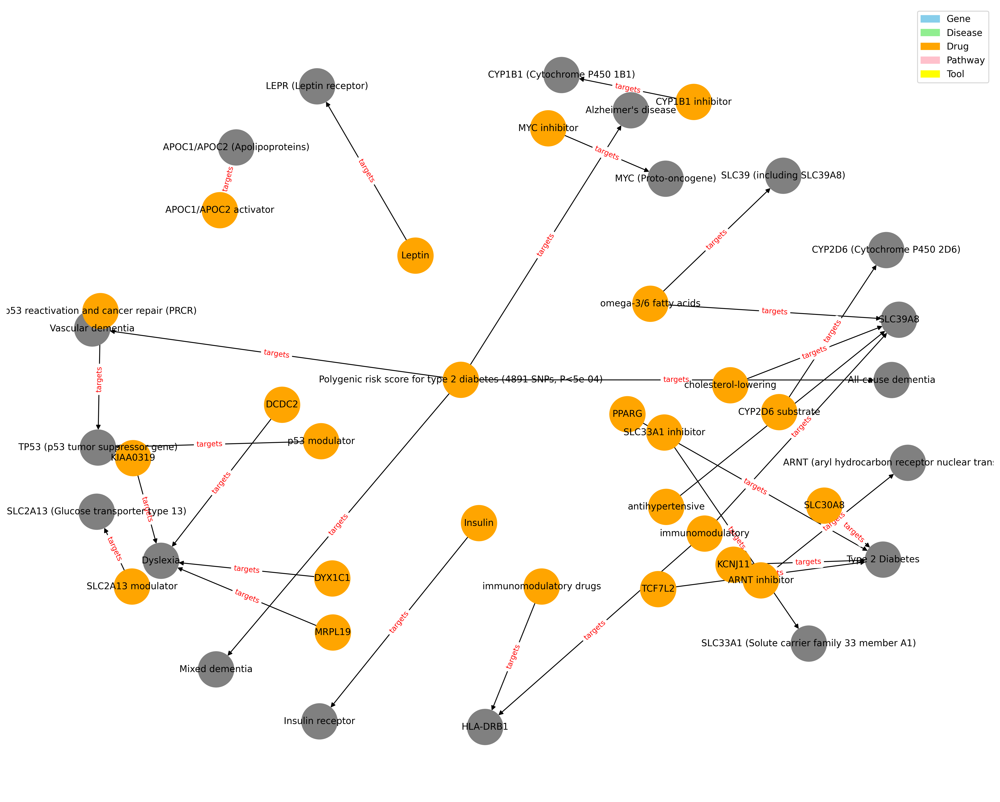

# RAG-Powered Gene Discovery Assistant (`ragbio`)

A generative AI tool for biomedical knowledge discovery using **Hugging Face embeddings** and **Ollama LLMs (DeepSeek / LLaMA3)**.
This project integrates **retrieval-augmented generation (RAG)** with PubMed literature and gene annotation data to summarize gene–disease relationships.
Now packaged as a **reusable Python package**, it can be imported and used in multiple bioinformatics projects.

---

## Overview

The RAG-powered assistant enables:

* Semantic search over PubMed abstracts and gene annotations.
* Summarization of complex biomedical information.
* Citation tracking with PubMed IDs.
* Modular and reusable pipeline for gene-disease exploration.

**Example queries:**

* "Which genes are linked to oxidative stress in Alzheimer’s disease?"
* "Summarize recent findings about TP53 variants in cancer."

---

## Architecture

```
User Query
│
▼
Vector Retrieval (BioBERT / BioSentVec Embeddings)
│
▼
Top Abstracts + Gene Annotations
│
▼
Ollama LLM (DeepSeek / LLaMA3)
│
▼
Summarized Biomedical Answer + Citations
```

---

## Installation

Clone and install as a package:

```bash
git clone https://github.com/<your-username>/rag-gene-discovery-assistant.git
cd rag-gene-discovery-assistant
pip install -e .
```

**Example `requirements.txt`**

```
langchain
faiss-cpu
sentence-transformers
biopython
pymed
requests
sqlite-utils
ollama
pandas
beautifulsoup4
```

---

## Usage

### 1. Fetch PubMed Data

```python
from ragbio.utils.data_loader import main as fetch_pubmed_data

# Download abstracts and metadata
fetch_pubmed_data()
```

### 2. Run RAG Query

```python
from ragbio import run_rag_query

result = run_rag_query("genes linked to Parkinson's disease")
print(result["summary"])
print(result["citations"])
```

#### Example Output Network

Here is an example of the **gene–disease–drug network** generated by the RAG pipeline:



*Figure 1: Gene–disease–drug co-occurrence network generated from top PubMed abstracts.*

---

### 3. Optional: Explore in Notebook

Open `notebooks/RAG_GeneDiscovery_Assistant.ipynb` to see example queries, visualizations, and outputs.

---

## Technologies Used

| Category     | Tool                                        |
| ------------ | ------------------------------------------- |
| Embeddings   | BioBERT, BioSentVec (Hugging Face)          |
| LLM Backend  | DeepSeek / LLaMA3 (Ollama)                  |
| Retrieval    | FAISS                                       |
| Data Sources | PubMed, UniProt, NCBI Gene                  |
| Language     | Python 3.10+                                |
| Frameworks   | LangChain (optional), Sentence Transformers |

---

## Future Enhancements

* Compare **DeepSeek/LLaMA3** with **BioGPT** outputs.
* Integrate **Neo4j** for gene–disease–drug knowledge graph visualization.
* Fine-tune LLMs on curated variant interpretation reports for improved clinical relevance.
* Extend package API for **direct integration in Django, FastAPI, and Streamlit apps**.

---

## Author

**Manish Kumar**
Senior Bioinformatics Software Developer | AI Researcher | Data Science Enthusiast
